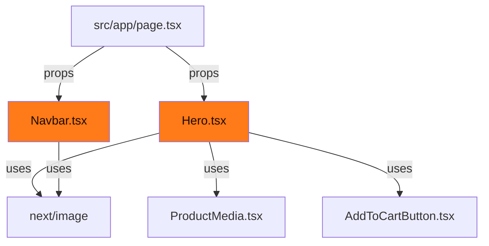

# Design Document: Homepage Redesign

## Overview

This design covers the visual refinements needed to bring the AuralEdge homepage to pixel-match the approved design reference. The scope is strictly presentational — no logic, data flow, or cart functionality changes.

The two primary changes are:

1. **Silhouette image in Hero** — Replace the CSS-only gradient background in the hero figure container with an actual `<Image>` element rendering `/assets/silueta.png`, layered beneath the existing glow and concentric circle pseudo-elements.
2. **Logo image in Navbar** — Replace the `◎` text character with a `next/image` `<Image>` component rendering `/assets/logo.jpg` as a 30px circular logo.

Secondary polish includes ensuring the glow radial gradient, concentric circle ring (`:before` pseudo-element), and dark overlay (`:after` pseudo-element) remain properly layered above the silhouette image.

### Design Rationale

- **Next.js `<Image>` component** is used for both images because it provides automatic optimization (WebP/AVIF), lazy loading, responsive `srcSet`, and built-in width/height for CLS prevention.
- **No new dependencies** are introduced. The project already has `next/image` available.
- **Existing CSS utilities are preserved** — `hero-figure`, `shadow-glow`, pseudo-element decorations all remain. The image is simply inserted inside the container as a new child element.
- **Fallback behavior** is handled naturally: if the image fails to load, the existing gradient background of the container remains visible (no layout shift).

---

## Architecture

The modifications touch exactly two component files and zero new files:



**Modified files:**
- `src/components/Hero.tsx` — Add `<Image>` for silueta.png inside the figure `<div>`
- `src/components/Navbar.tsx` — Replace `◎` span with `<Image>` for logo.jpg

**Unchanged files (explicitly out of scope):**
- `src/app/page.tsx` — orchestration stays the same
- `src/context/CartContext.tsx`, `src/components/CartDrawer.tsx`, `src/components/AddToCartButton.tsx` — cart logic untouched
- `src/lib/strapi.ts`, `src/lib/mock-data.ts`, `src/lib/types.ts` — data layer untouched
- `src/app/globals.css` — all existing utilities preserved as-is

---

## Components and Interfaces

### Hero.tsx Changes

**Current state:** The hero figure container is a self-closing `<div>` with `hero-figure` utility providing the background gradient. The `:before` pseudo-element renders the concentric circle ring, and `:after` renders a dark overlay.

**Target state:** Convert the self-closing `<div>` to an open `<div>...</div>` containing an `<Image>` element for silueta.png. The image sits at z-index 1 (between the background gradient at z-0 and the pseudo-elements at z-2+).

```tsx
// Before (self-closing div)
<div className="... hero-figure ..." />

// After (with Image child)
<div className="... hero-figure ...">
  <Image
    src="/assets/silueta.png"
    alt="Person wearing AuralEdge headphones with ambient glow"
    fill
    sizes="(max-width: 1024px) 100vw, 760px"
    className="object-cover object-top z-[1]"
    priority
  />
</div>
```

**Key details:**
- `fill` prop: Image fills the container (which already has `relative` via the pseudo-element styling)
- `object-cover object-top`: Ensures the silhouette fills the frame with the head/glow area prominent
- `z-[1]`: Positions the image above the background gradient but below the `:before` (z-2) and `:after` pseudo-elements
- `priority`: Hero image is LCP — no lazy loading
- `sizes`: Matches the container's responsive behavior (full width on mobile, 760px max on desktop)

### Navbar.tsx Changes

**Current state:**
```tsx
<span className="text-xl text-brand">◎</span> AURALEDGE
```

**Target state:**
```tsx
<Image
  src="/assets/logo.jpg"
  alt="AURALEDGE logo"
  width={30}
  height={30}
  className="rounded-full"
/>
AURALEDGE
```

**Key details:**
- Fixed `width={30}` and `height={30}` (explicit dimensions, no layout shift)
- `rounded-full`: Circular clip as required
- The parent `<a>` already has `flex items-center gap-2` — the 8px gap between logo and text is provided by the existing `gap-2` class
- `alt="AURALEDGE logo"`: Accessible description per requirements
- No `priority` needed — Navbar is fixed but the logo is small and non-LCP

### Import Addition

Both files need `import Image from "next/image"` added at the top. Hero.tsx doesn't currently import it (it delegates to `ProductMedia`). Navbar.tsx also doesn't import it.

---

## Data Models

No changes to data models. The existing `Product`, `Testimonial`, `CartItem`, and `StrapiImage` interfaces remain unchanged.

The images are static assets in `/public/assets/` — no CMS integration needed for them.

---

## Correctness Properties

Not applicable for this feature. This redesign is purely presentational — it adds static images to existing UI containers with no data transformations, business logic, or algorithmic behavior. Property-based testing requires universal properties that hold across varying inputs, which does not apply to image insertion and CSS styling.

Appropriate alternatives (visual regression, render assertions, accessibility checks) are covered in the Testing Strategy section below.

---

## Error Handling

| Scenario | Behavior |
|----------|----------|
| `/assets/silueta.png` fails to load | The `hero-figure` background gradient remains visible. The `<Image>` element simply shows nothing (transparent), and the container maintains its dimensions via `h-[360px]` / `lg:h-[520px]`. No layout shift. |
| `/assets/logo.jpg` fails to load | The "AURALEDGE" text remains displayed. The `<Image>` collapses to its 30×30 box but shows nothing. The flex layout with `gap-2` absorbs this gracefully — worst case is a small empty gap. |
| Slow network | `priority` on the hero image triggers preload. The logo is 30×30 and tiny. Both are local `/public` assets served by Next.js — no external dependency. |

No new error states, error boundaries, or loading indicators are needed.

---

## Testing Strategy

### Why Property-Based Testing Does NOT Apply

This feature is purely UI rendering — replacing a text character with an image element, and adding an image child to an existing container. There are:
- No data transformations or business logic changes
- No input/output functions to verify across ranges of inputs
- No serialization, parsing, or algorithmic behavior
- No universal properties that hold across varying inputs

The appropriate testing strategies are:

### Visual/Manual Testing
- **Browser inspection**: Verify silueta.png renders inside the hero figure container with proper z-layering (image below ring, above gradient)
- **Logo verification**: Confirm logo.jpg appears as a 30px circle in the Navbar with proper alt text
- **Responsive check**: Test at mobile (<1024px) and desktop (≥1024px) breakpoints to confirm layout integrity
- **Fallback test**: Temporarily rename image files to verify graceful degradation

### Unit/Integration Tests (Example-Based)
- **Render test for Hero**: Assert the component renders an `` element with `src` containing "silueta.png" and proper `alt` attribute
- **Render test for Navbar**: Assert the component renders an `` element with `src` containing "logo.jpg", `alt="AURALEDGE logo"`, and appropriate dimensions
- **Accessibility check**: Verify both images have meaningful `alt` attributes
- **Existing functionality preserved**: Cart buttons still trigger `openCart`, navigation links still smooth-scroll

### Snapshot Tests (Optional)
- Capture rendered HTML output of Hero and Navbar components to detect unintended regressions in future changes

### Test Configuration
- Use existing Next.js testing setup (if any) or `@testing-library/react` with `next/image` mock
- No minimum iteration count needed (no PBT)
- Focus on concrete examples that verify the two image insertions and their attributes
